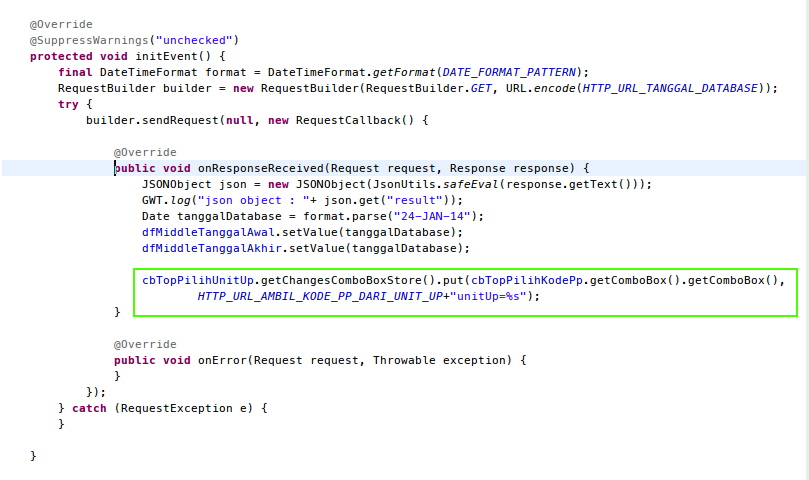

Development Guide
=================

Saat ini ada 2 *Abstract Class* yang berguna untuk membantu para developer untuk dapat mengerjakan pekerjaannya.

1. **AbstractComboComponent**
2. **AbstractForm**

Untuk lebih jelasnya dapat dibaca pada keterangan di bawah ini :   
***  

**AbstractComboComponent**
========================== 
Kelas component yang meng-extend kelas **AbstractComboComponent** akan memiliki kemampuan untuk merubah value component yang lain apabila component combobox yang kita definisikan nilainya berubah oleh karena terjadinya event select.

Cara untuk merubah valuenya dapat dilihat pada gambar berikut :

method yang bisa digunakan untuk meregistrasi component yang lain antara lain adalah : 

* getChangesGridStore  
    Untuk mendaftarkan grid mana yang akan berubah karena value combobox
* getChangesFieldValue  
    Untuk mendaftarkan text field mana yang akan berubah karena value combobox
* getChangesComboBoxStore  
    Untuk mendaftarkan store combobox mana yang akan terupdate karena value combobox

> Saat ini sudah di apply ke semua components combobox kita, yang berada di package **id.co.hans.sample.client.components** (Kecuali IconComboBox). 

**AbstractForm**
================
Kelas Form yang meng-extends Kelas AbstractForm ini akan mendapatkan 2 Method secara gratis untuk diimplementasikan pada kelas tersebut.

Method yang harus diimplementasikan antara lain :
* initEvent
    isi implementasi dari method ini adalah untuk meregistrasikan event/handler yang terjadi di component-component yang telah di definiskan pada kelas tersebut.
* panelMain
    ini implementasi dari method ini adalah untuk mendefinisikan/menginisialisasi component-component yang terdapat pada kelas tersebut.

	
**TESTING**